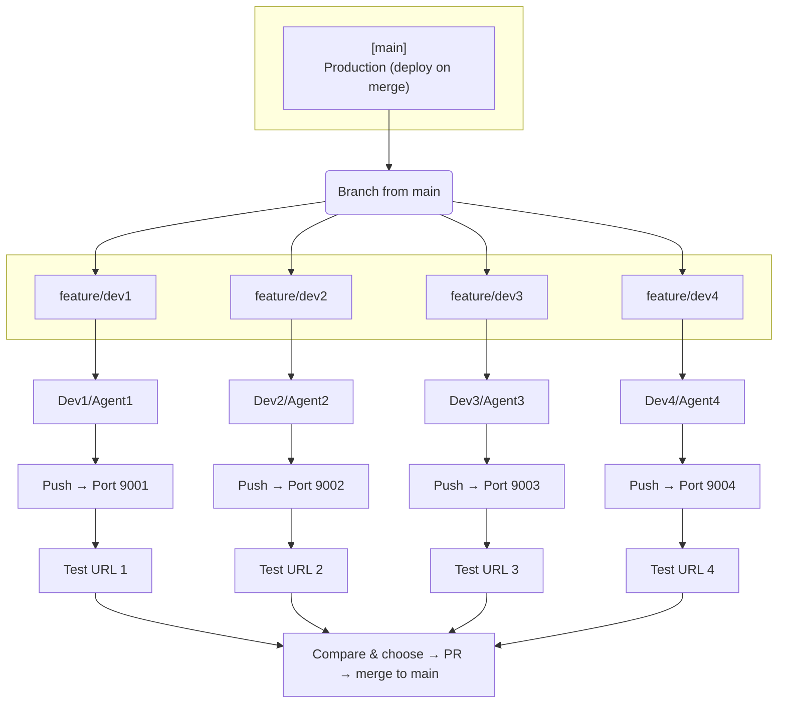
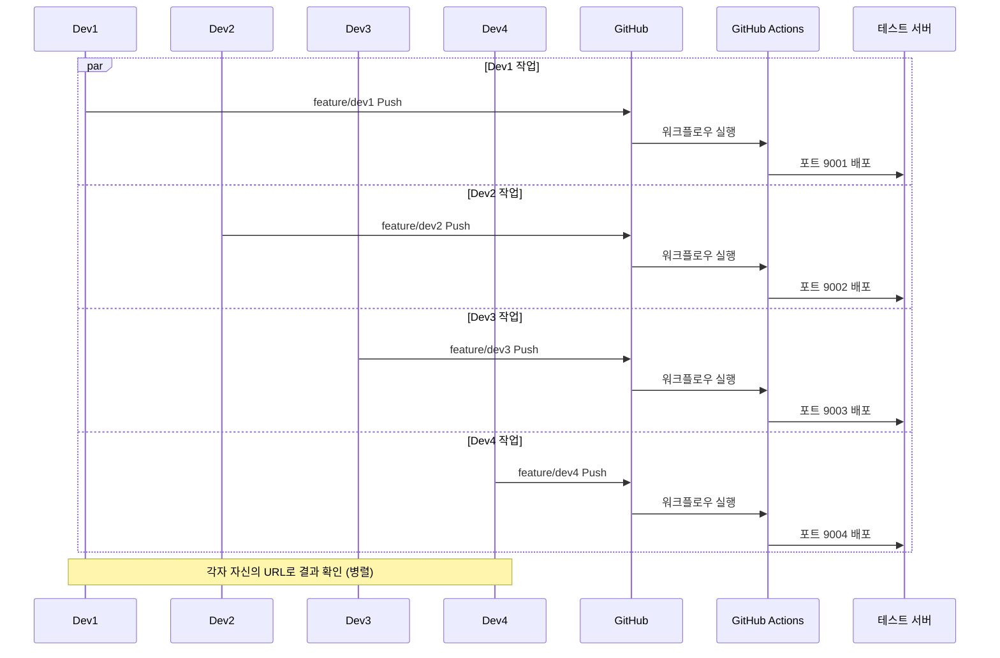
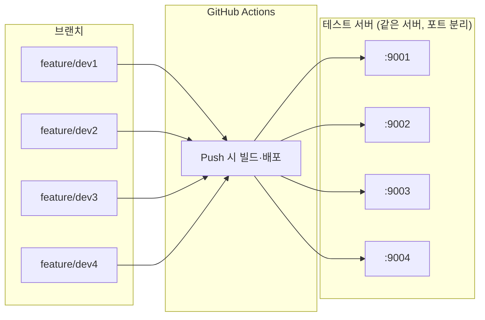

# 4인 다중 브랜치 전개도

PROPOSAL.md에서 정리한 "4명이 각각 브랜치에서 병렬 작업 → 각자 테스트 서버 배포 → 선택하여 main PR → 프로덕션" 구성을 도식화한 문서입니다.

---

## 1. 전체 구조 (한눈에 보기)

```
                    ┌─────────────┐
                    │    main     │  ← Production (Deploy when merge)
                    └──────┬──────┘
                           │
         ┌─────────────────┼─────────────────┼─────────────────┐
         │                 │                 │                 │
         ▼                 ▼                 ▼                 ▼
   feature/dev1      feature/dev2     feature/dev3     feature/dev4
   (Dev1 / Agent1)   (Dev2 / Agent2)  (Dev3 / Agent3)  (Dev4 / Agent4)
         │                 │                 │                 │
         │ Push            │ Push             │ Push            │ Push
         ▼                 ▼                 ▼                 ▼
   Port 9001          Port 9002         Port 9003         Port 9004
   Test URL 1       Test URL 2      Test URL 3      Test URL 4
         │                 │                 │                 │
         └─────────────────┴────────┬────────┴─────────────────┘
                                    │
                          Compare & Merge PR  → main Merge
```

### 나노 바나나로 그릴 때 (정확히 그리게 하는 방법)

**1) 한 번에 넣을 프롬프트 (영어, 복사해서 통째로 붙여넣기)**

```
Draw exactly this structure. Do not skip any item or swap labels.

TOP: One box "[main]", subtitle "Production (deploy on merge)". One vertical line down from it. At the bottom of that line, write "Branch from main". From that single point, split into exactly FOUR branches going to the right (or down then right). All four must start from the same "Branch from main" point.

ROW 1 - Four branch boxes in a row, left to right:
  [feature/dev1]  [feature/dev2]  [feature/dev3]  [feature/dev4]

ROW 2 - Under each branch, one label:
  Dev1/Agent1    Dev2/Agent2    Dev3/Agent3    Dev4/Agent4

ROW 3 - From each branch, arrow labeled "Push" to a Port box:
  Push → Port: 9001   Push → Port: 9002   Push → Port: 9003   Push → Port: 9004

ROW 4 - Under each Port, one label:
  Test URL 1    Test URL 2    Test URL 3    Test URL 4

BOTTOM: The four columns merge back into one line, then one box: "Compare & choose → PR → merge to main".

CRITICAL: There must be exactly 4 branches. feature/dev2 must appear (do not skip it). Dev/Agent and Port/Test URL must match: dev1→9001→Test URL 1, dev2→9002→Test URL 2, dev3→9003→Test URL 3, dev4→9004→Test URL 4.
```

**2) 그렸는데 틀리면 → 아래 체크리스트를 복사해서 보내기**

```
수정 요청:
- 브랜치는 정확히 4개: feature/dev1, feature/dev2, feature/dev3, feature/dev4 (dev2 빠지면 안 됨)
- 매칭: dev1→Port 9001→Test URL 1, dev2→Port 9002→Test URL 2, dev3→Port 9003→Test URL 3, dev4→Port 9004→Test URL 4
- Dev/Agent: dev1→Dev1/Agent1, dev2→Dev2/Agent2, dev3→Dev3/Agent3, dev4→Dev4/Agent4 (순서/이름 바꾸지 말 것)
- main에서 한 줄기 내려온 뒤 "Branch from main" 지점에서 4갈래로 분기해야 함 (main에서 가져온 느낌 나게)
```

**3) 대안: Mermaid로 전체 구조 (나노 바나나 대신 사용 가능)**

GitHub·Notion·VS Code 미리보기에서 바로 그림으로 렌더링됨. 아래 블록을 그대로 복사해 사용하면 됨.



---

## 2. Mermaid 시퀀스: Push부터 배포까지



---

## 3. Mermaid 플로우: 브랜치 → 포트 매핑



---

## 4. 전개 타임라인 (대략적 흐름)

```mermaid
gantt
    title 4인 병렬 개발 → 선택 → 프로덕션
    dateFormat X
    axisFormat %s

    section Dev1
    작업 & Push (dev1)     :d1, 0, 3
    테스트 (9001)          :t1, after d1, 2

    section Dev2
    작업 & Push (dev2)     :d2, 1, 3
    테스트 (9002)          :t2, after d2, 2

    section Dev3
    작업 & Push (dev3)     :d3, 0, 4
    테스트 (9003)          :t3, after d3, 2

    section Dev4
    작업 & Push (dev4)     :d4, 2, 3
    테스트 (9004)          :t4, after d4, 2

    section 통합
    비교·선택·PR·머지      :crit, 5, 2
    프로덕션 배포          :prod, after crit, 1
```



---

## 5. 확장 단계 (100단위 포트) 개념도

PROPOSAL에서 언급한 "각 개발자당 100단위 포트 범위"일 때:

```
feature/dev1  →  9000–9099  (dev1이 여러 버전 동시 테스트 가능)
feature/dev2  →  9100–9199
feature/dev3  →  9200–9299
feature/dev4  →  9300–9399
```

---

## 6. 요약 표

| 구분 | 내용 |
|------|------|
| **인원** | 4명 (또는 AI Agent 4개) |
| **브랜치** | `feature/dev1` ~ `feature/dev4` |
| **테스트 포트** | 9001, 9002, 9003, 9004 (초기) |
| **트리거** | 각 브랜치 Push |
| **결과** | 브랜치별 독립 컨테이너, 즉시 URL로 확인 |
| **프로덕션** | 선택한 브랜치를 main에 PR → 머지 시 배포 |

---

*이 전개도는 PROPOSAL.md의 "하고자 하는 것"을 시각화한 것입니다. 실제 워크플로우는 `.github/workflows/multi-branch-deploy.yml`을 참고하세요.*
