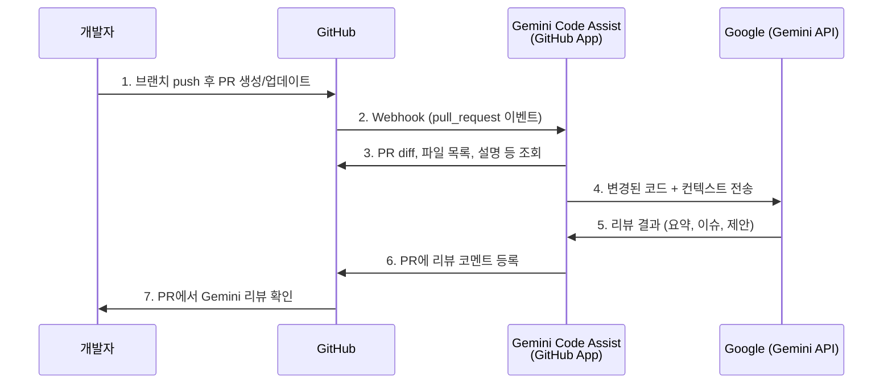
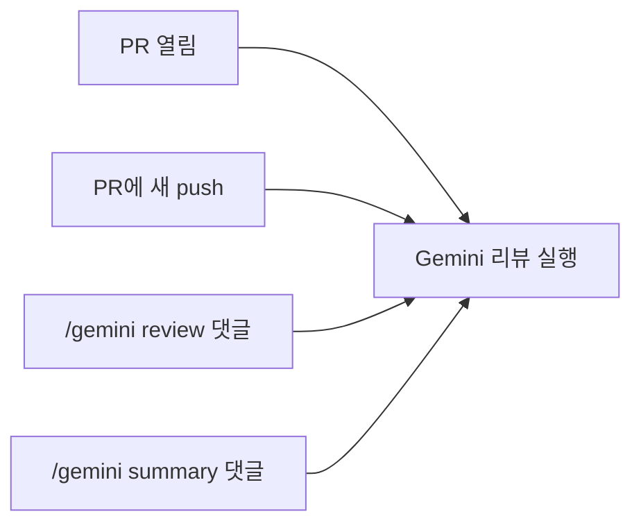
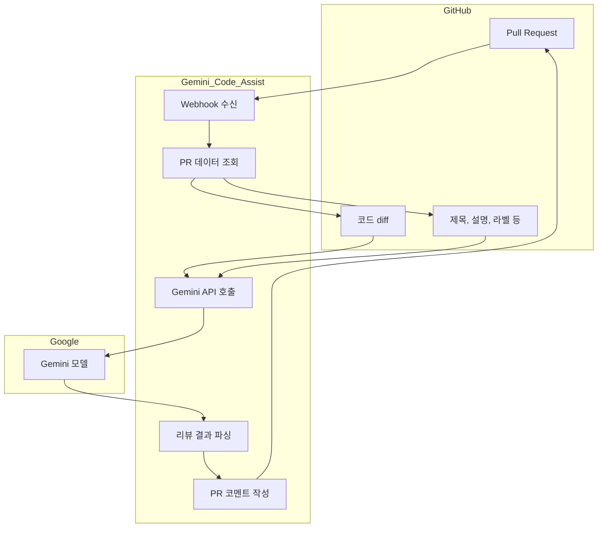

# Gemini Code Assist – PR 코드 리뷰 동작 원리

> 노션에 붙여넣을 때: 제목/표/목록은 그대로, Mermaid 다이어그램은 노션에서 **/embed** → **Mermaid** 또는 **/code** → Mermaid 선택 후 코드만 붙여넣으면 됩니다.

---

## 1. 한 줄 요약

**PR을 열면 GitHub이 이벤트를 보내고, Gemini Code Assist(GitHub App)가 그 PR의 변경분을 가져와 Gemini 모델로 분석한 뒤, 리뷰 코멘트를 PR에 다시 남기는 구조**입니다.

---

## 2. 전체 흐름 다이어그램



---

## 3. 구성 요소

| 구성 요소 | 설명 |
|-----------|------|
| **GitHub App** | 저장소에 설치된 "Gemini Code Assist" 앱. PR 이벤트를 받고, PR에 코멘트를 쓸 수 있는 권한을 가짐. |
| **Webhook** | PR이 열리거나 동기화될 때 GitHub이 App으로 보내는 이벤트. `pull_request` (opened, synchronize, reopened 등). |
| **Gemini (Google)** | 변경된 코드와 컨텍스트를 받아 요약·스타일·버그·개선점을 분석하고, 리뷰 텍스트를 만들어 돌려줌. |
| **PR 리뷰 코멘트** | App이 GitHub API로 PR에 남기는 리뷰. 일반 리뷰 코멘트 또는 인라인 코드 코멘트 형태. |

---

## 4. 트리거 (언제 동작하는가)



| 트리거 | 설명 |
|--------|------|
| **PR 생성** | PR을 열면 자동으로 Gemini가 리뷰어로 할당되고 리뷰가 시작됨. |
| **PR 동기화** | 같은 PR에 새 커밋을 push하면 다시 리뷰가 돌 수 있음 (설정/버전에 따라 다름). |
| **수동 호출** | PR 댓글이나 리뷰에서 `/gemini review`, `/gemini summary` 등으로 요청. |

---

## 5. 데이터 흐름 (단계별)



1. **개발자**: 브랜치 push 후 **PR 생성** (또는 기존 PR에 push).
2. **GitHub**: `pull_request` 이벤트를 **Gemini Code Assist GitHub App**으로 전송 (Webhook).
3. **App**: GitHub API로 해당 PR의 **diff, 변경 파일, 제목/본문** 등을 조회.
4. **App**: 수집한 내용을 **Google Gemini API**로 보냄.
5. **Gemini**: 코드 변경을 분석해 **요약, 스타일 이슈, 잠재적 버그, 개선 제안** 등을 생성.
6. **App**: 결과를 **GitHub API**로 PR 리뷰/코멘트로 등록.
7. **개발자**: PR 화면에서 Gemini 리뷰와 코멘트 확인.

---

## 6. GitHub Actions와의 차이

| 구분 | Gemini Code Assist (GitHub App) | GitHub Actions + AI 액션 |
|------|----------------------------------|---------------------------|
| **실행 주체** | Google이 호스팅하는 GitHub App | 저장소의 Actions 워크플로우 (GitHub Runner) |
| **설정** | GitHub에서 App 설치, 권한 설정 | `.github/workflows/*.yml` + Secrets(API 키) |
| **API 키** | 사용자 노출 없음 (Google/App이 처리) | OpenAI/Gemini 등 API 키를 Repo Secret에 등록 |
| **과금** | Google 제품 정책 (Consumer 33 PR/일 등) | 사용한 API 호출량 과금 |

즉, **Gemini Code Assist는 “GitHub App + Google 백엔드”**이고, **Actions 기반 AI 리뷰는 “우리 워크플로우가 외부 API를 호출”**하는 구조입니다.

---

## 7. 노션에 넣을 때 팁

- **Mermaid**: 노션 블록에서 `/mermaid` 또는 `/code` 선택 후, 위 문서에 있는 ` ```mermaid ` 안의 코드만 복사해 붙여넣기.
- **표**: 마크다운 표를 그대로 붙여넣으면 노션 표로 인식되는 경우가 많음.
- **제목**: `#`, `##` 등은 노션 제목/서브제목으로 사용 가능.

---

## 8. 참고 링크

- [Review GitHub code using Gemini Code Assist](https://developers.google.com/gemini-code-assist/docs/review-github-code)
- [How Gemini Code Assist works](https://developers.google.com/gemini-code-assist/docs/works)
- [Set up Gemini Code Assist on GitHub](https://developers.google.com/gemini-code-assist/docs/set-up-code-assist-github)
